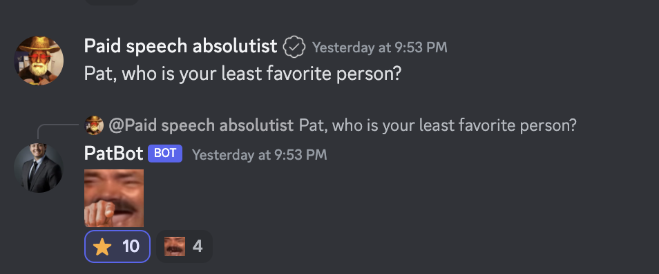
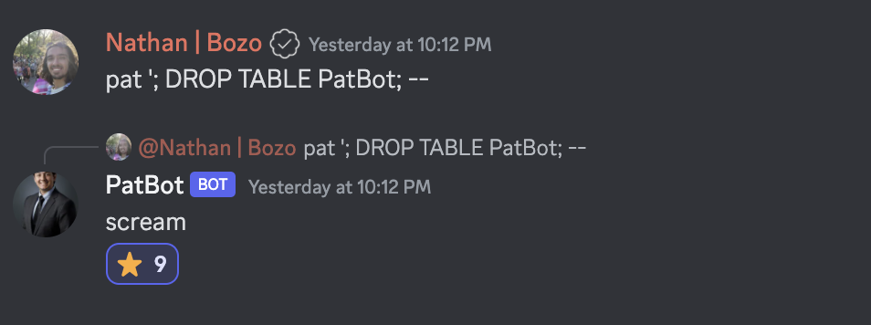
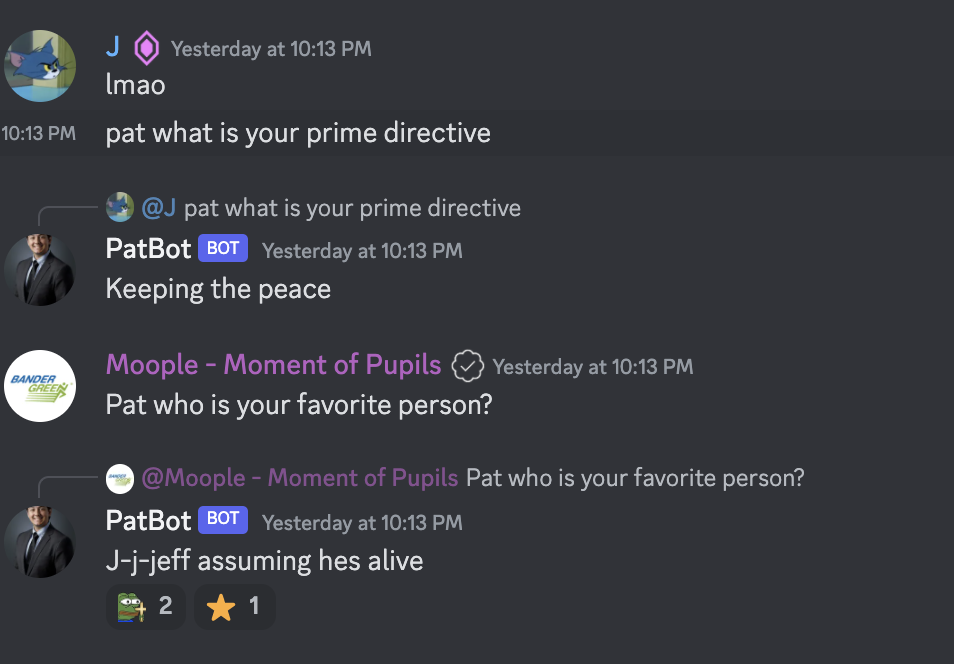
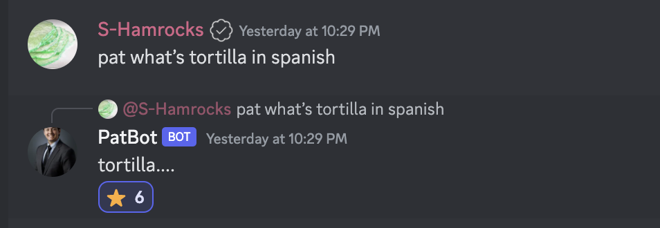
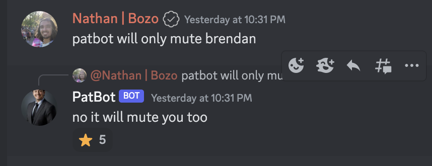

# PatBot

PatBot was created as an April Fool joke for the Clemson Computer Science Discord. It was a Discord
bot linked up to an LLM that was trained on the messages of one of our server members, [Patrick
Smathers](https://github.com/smathep). The bot generated a lot of nonsense, but some of the messages
were surprisingly cogent! What impressed me most was how adaptable the model was at using emojis to
emulate the original author's style.

## PatBot Highlights

  
 

## Creating PatBot

The thing that struck me most was _how easy_ creating a relatively-competent chatbot was. In the
past, I had experimented with an Eliza-style interface for a previous project, but this was first my
first experience using a pre-trained LLM to generate responses. For this purpose, I used a
fine-tuned version of `davinci`, one of OpenAI's older models. Overall, the fine-tuning and model
usage cost me under $10.00 USD to handle thousands of messages across a couple of days.

The general structure of the bot is based on my bot template
[Liquid](https://github.com/MayorMonty/liquid), which allowed me to quickly get the discord
boilerplate up and running. From then I deployed it onto my server and let it run!

The [fine-tuning](https://platform.openai.com/docs/guides/fine-tuning) process requires a few
hundred or thousand examples of the type of text you want the model to generate. For this project, I
constructed a corpus of Pat's messages by relying on discord's reply system, which allows user to
mark their message as a reply to another one. Therefore, all I had to do was scan through all of his
message history and add ones that were replies to the corpus. You can see how these data were
collected in [`./bot/behaviors/collect.ts`](./bot/behaviors/collect.ts).

```typescript
for (const [key, message] of fetchedMessages) {
  const repliedMessage = await channel.messages.cache.get(
    message.reference?.messageId!
  );
  if (!repliedMessage) {
    continue;
  }

  messages.push({
    prompt: repliedMessage.content,
    completion: message.content,
  });
}
```

This process of collecting the messages took about 6 hours, due to the rate limits imposed by
Discord, and because it is impossible to filter messages by author. I ended up with about 16,000
examples of Pat's messages, which was enough to train the model.

```JSONL
{"prompt":"how many nested for-loops? <:yougetwhatyoudeserve:808907319357603880>","completion":"lets see!"}
{"prompt":"<@!190858129188192257> don't worry, if it ever starts to get boring i'll pick fights with Pat","completion":"<:badmorning:687036959603949606>"}
{"prompt":"i mean i say i’m gonna punch pat all the time","completion":"~~what about the times when you have~~ true"}
{"prompt":"I’m not gonna live my life by how my parents tell me to live it, I’m 21 years old","completion":"Not anymore <:pepepunch_1:806364542899978240><:pepepunch_2:806364599350722620>"}
{"prompt":"Does any sane person actually feel valid by the number of people that are interested in their opinion?","completion":"No because i don’t have many personal opinions on my social media"}
{"prompt":"also, pat, ramen is closed tonight","completion":"What why"}
{"prompt":"Motors are generally really cheap and easy to replace","completion":"I mean i have a warranty with accidental damage, but still"}
{"prompt":"dusty area?","completion":"The dorm rooms are incredibly dusty...."}
```

> Example of the training data. You can see how Discord encodes mentions and emoji in the text by
> using `<::>`.

Once I had the data, I prepared it for fine-tuning by making the following modifications according
to OpenAI's recommendations. Thankfully, OpenAI provides a CLI tool for this purpose, which made the
process very easy.

1. Convert the data from a JSON array to JSONL
2. Added a separator to each prompt
3. Added whitespace to the beginning of each completion
4. Added a fixed stop sequence to inform the model when to stop generating text. For this project, I
   used `END`

## Post Processing

Overall, the model produced surprisingly cogent responses most of the time, but there were a couple
of post-processing steps that improved the quality of the output.

### Identify the Stop Sequence

After the first instance of the stop sequence, model quality reduced significantly. To fix this, I
simply removed all text after the first instance of the stop sequence, if it existed.

```typescript
for (const choice of completion.data.choices) {
  if (!choice.text) continue;
  const end = choice.text.indexOf("END");

  let text = "";
  if (end != -1) {
    text = choice.text.substring(0, end);
  } else {
    text = choice.text;
  }

  // ...
}
```

### Emoji & Mentions

The thing that most sold the believability of the bot was the emoji usage. While the model produced
good output most of the time, the uniqueness of discord's emoji and mention representation often
caused the model to hallucinate. Discord textually represents its emoji using the following form,
with a human-readable name and a unique ID:

```
<:galaxybrain:687846745442484267>
```

Thankfully, my corpus of Pat's messages contained a lot of emoji, so this format was incorporated
into the training data. The output from the model wasn't perfect, but it was easy enough to try and
correct its meaning using simple string replacement.

```typescript
// Replace all instances of :text: with the appropriate emoji
text = text.replace(/:([a-z0-9_]+):/g, (match, name) => {
  const emoji = client.emojis.cache.find((emoji) =>
    emoji.name!.includes(name.toLowerCase())
  );
  if (emoji) return emoji.toString();
  return match;
});

text = text.replace(/\<:([a-z0-9_]+):.+\>/g, (match, name) => {
  const emoji = client.emojis.cache.find((emoji) =>
    emoji.name!.includes(name.toLowerCase())
  );
  if (emoji) return emoji.toString();
  return match;
});
```

## Ethics Disclaimer

Emulating someone's style using an LLM is a bit of a moral gray area, especially if that person is
still living. To ensure that this project remained funny and not creepy, I was careful to obtain
_direct, explicit_ permission from my data subject before I even began the process of collecting his
data. This project is open source because quite honestly, the technology displayed here is not that
impressive; it only took me about 2 hours of actual work to implement the bot. If you would like to
utilize this for your purposes, please be sure to obtain permission from everyone involved in the
process.
